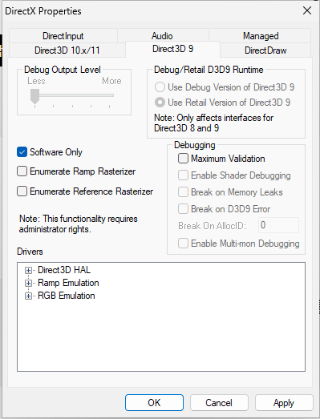

## 현재 환경

* Macbook Pro M3pro
* VMware Fusion Player 13.5.0
* Windows 11 arm
* Ctrix Workspace 23.9.1.104 (2309.1)

## 상황

현재 Ctrix Workspace를 사용하여 가상 데스크톱 인프라(VDI)를 구축하고 접속해서 업무를 진행하고 있습니다.
최근 맥북으로 변경하고 VMware를 사용하여 Windows 11 arm 버전을 설치한 뒤 접속하였는데 너무 반응속도가 느렸습니다.
CPU나 메모리 사용도 여유로웠고 VDI 밖에서 네트워크도 준수한 속도를 가지고 있었습니다.

검색을 해보니 3D 가속에 이슈가 있어보이고 옵션을 끄는 방식으로 해결이 가능합니다.

## 방법 1 - VMware에서 `Accelerate 3D Graphics` 끄기

VM이 꺼진 상태에서 `Virtual Machine > Settings > Display` 메뉴로 이동 후 `Accelerate 3D Graphics` 체크를 해지 합니다.

## 방법 2 - DirectX SDK 설치 후 software only로 변경

{}

### DirectX SDK를 설치

Windows에서 DirectX SDK를 설치합니다.

다운로드 경로 : https://www.microsoft.com/ko-kr/download/details.aspx?id=6812

### DirectX Control Panel 설정변경

DirextX Control Panel을 실행한 뒤 `Direct3D 9` 탭에서 `Software Only`를 체크합니다.

{}