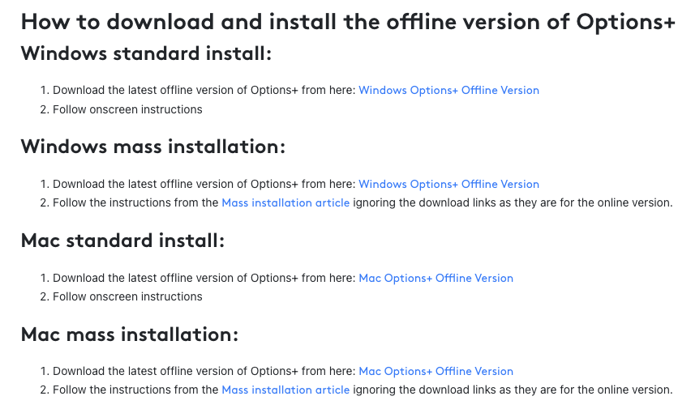

## 현상

프록시가 있는 사내 환경에서 Logi Options+를 설치하고 사용하려고 했습니다.
그런데 설치가 잘 안되거나 실행이 안되는 현상이 있어 해결한 방법을 공유합니다.

## 해결방법 1 - offline 설치

기본 설치파일은 온라인을 경유하여 다운로드를 받게 됩니다.
따라서 프록시나 인터넷이 안되는 환경에서는 다음 오프라인 버전을 사용합니다.

[https://prosupport.logi.com/hc/en-us/articles/10991109278871-Logitech-Options-Offline-Installer](https://prosupport.logi.com/hc/en-us/articles/10991109278871-Logitech-Options-Offline-Installer)

내용 중간의 **Windows Options+ Offline Version** 또는 **Mac Options+ Offline Version**을 선택하여 받으면 됩니다.



## 해결방법 2 - --no-sandbox 옵션

설치까지 완료하였는데 실행에서 문제가 있을 수 있습니다.
현상은 보통 실행시켰는데 화면이 나오지 않고 아무 반응이 없습니다.

설치된 경로 (보통 `C:\Program Files\LogiOptionsPlus`)에 보면 `debug.log` 파일이 있고 내용을 보면 다음과 같을 것 입니다.

```
Failed to load C:\Program Files\LogiOptionsPlus\chrome_100_percent.pak
Some features may not be available.
```

일부 기능로딩에 문제가 있고 임시방편으로 sandbox 모드를 해제하는 것 입니다.
아래와 같이 명령 끝에 `--no-sandbox`를 추가하여 실행하면 정상실행됩니다.

```
C:\Program Files\LogiOptionsPlus> logioptionsplus.exe --no-sandbox
```

다만 보안적 요소와 관련된 설정이므로, 필요한 설정을 마친 뒤 프로세스를 꼭 종료해야합니다.